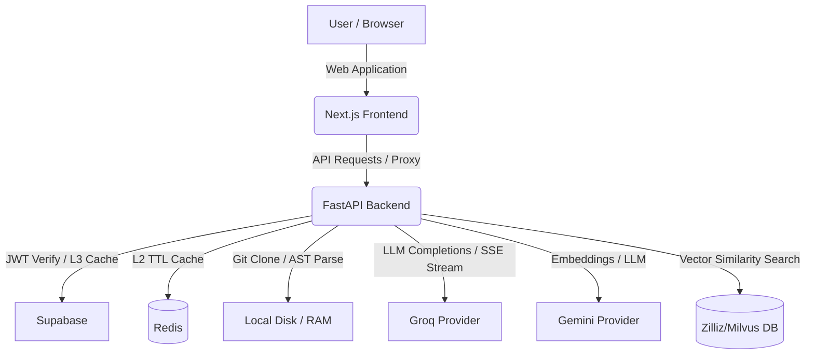

# CodeKAVI: Codebase Intelligence Platform

CodeKAVI is an AI-powered codebase intelligence platform. It ingests repositories, maps dependency structures, performs smart code role classification, indexes source code chunks for RAG semantic search, and provides interactive, section-by-section AI-generated walkthroughs and explanation streams.

---

## Architecture Overview

CodeKAVI consists of a **FastAPI backend** and a **Next.js frontend**, coordinated using **Redis** for L2 caching and rate limit storage, **Supabase** for user database persistence, **Zilliz/Milvus** for vector searches, and **Groq (Llama 3.3)** and **Gemini** LLM providers.



### Pipelines Flow
1. **Cloning & Parsing**: Repository cloned off-event-loop, structural tree traversed.
2. **AST Analysis**: Imports extracted (Python AST, JS/TS/Go regex) and resolved. A structural dependency graph is built, and central files/entry points are ranked.
3. **Role Classification**: Code profiles are classified into 14 roles (e.g. entry-points, config, utilities) using a memory-bounded cache.
4. **Vector RAG**: Source file chunks are embedded using Gemini and loaded into Zilliz database.
5. **Streaming Explanations**: Concurrent LLM calls generate walkthroughs (overview, complexity, modules, mindmaps) streamed over SSE.

---

## Getting Started (Docker Compose)

The easiest way to run the entire stack locally is using Docker Compose:

### 1. Configure Environment Variables
Create a `.env` file at the root directory of the repository (or copy values to `backend/.env` and `frontend/.env`):

```env
# Backend Keys
GROQ_API_KEY=your_groq_api_key
GEMINI_API_KEY=your_gemini_api_key
ZILLIZ_URI=your_zilliz_cluster_uri
ZILLIZ_API_KEY=your_zilliz_api_key
REDIS_URL=redis://redis:6379/0
SUPABASE_URL=your_supabase_project_url
SUPABASE_SERVICE_KEY=your_supabase_service_role_key
SUPABASE_JWT_SECRET=your_supabase_jwt_secret

# Frontend Keys
NEXT_PUBLIC_SUPABASE_URL=your_supabase_project_url
NEXT_PUBLIC_SUPABASE_ANON_KEY=your_supabase_anon_public_key
```

### 2. Boot the services
Build and run the containers in detached mode:
```bash
docker compose up --build -d
```

Once booting completes, you can access:
- **Next.js Web App**: [http://localhost:3000](http://localhost:3000)
- **FastAPI Documentation (Swagger UI)**: [http://localhost:8000/docs](http://localhost:8000/docs)
- **Backend Health Check**: `curl http://localhost:8000/api/health`

---

## API Summary

### Authentication
Protected endpoints require a JWT token in the `Authorization` header:
`Authorization: Bearer <Supabase_User_JWT>`

### Endpoints
*   `GET    /api/health` — Public health check.
*   `POST   /api/analyze` — Run static analysis on a GitHub repository.
*   `POST   /api/analyze/stream` — SSE version of static analysis, showing progress in real-time.
*   `GET    /api/graph/{repo_id}` — Get the dependency graph of an analyzed repository (formats: `json`, `dot`, `mermaid`).
*   `POST   /api/explain/{repo_id}` — Generate high-level walkthroughs.
*   `POST   /api/explain/{repo_id}/stream` — Stream architecture walkthrough sections in parallel.
*   `POST   /api/explain/file/{repo_id}` — Generate detailed explanations for a single file.

---

## Developer Guide

### Prerequisites
- Python 3.12+
- Node.js 22+
- Git

### Backend Setup
```bash
cd backend
python -m venv venv
source venv/bin/activate  # or venv\Scripts\activate on Windows
pip install -r requirements.txt -r requirements-dev.txt
```

Run checks & tests:
```bash
make lint        # Ruff Linter
make typecheck   # Mypy Typecheck
make test        # Pytest test suite
make run         # Start development server
```

### Frontend Setup
```bash
cd frontend
npm install
npm run dev      # Start Next.js dev server
```
