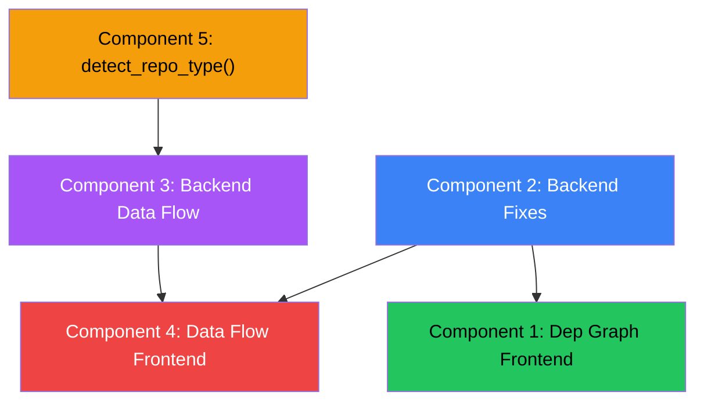

# Dependency Graph & Data Flow Diagram — Implementation Plan

## Goal

Improve and extend the two core visualizations in CodeKAVI:

1. **Dependency Graph** — Fix existing bugs, add auto-detect layout, improve visual quality, add theme support
2. **Data Flow Diagram** — Transform from a re-skinned dependency graph into a true data flow visualization with hybrid static+LLM generation, distinct visual language, and rich interactivity

Both visualizations should work correctly on real-world repos (fixing the failure modes documented in [implementation.md](file:///Applications/Projects/CodeKavi/implementation.md)) and support dark + light themes via `next-themes`.

---

## User Review Required

> [!IMPORTANT]
> **Scope of backend fixes**: This plan focuses on the *visualization layer* (frontend rendering + backend viz endpoints). It assumes the backend analysis pipeline fixes from [implementation.md](file:///Applications/Projects/CodeKavi/implementation.md) Steps 1-11 (shared resolver, HTML/CSS extractors, path aliases, Java crash fix, Go/Rust resolvers) will be addressed separately. Those fixes populate the `adjacency` and `edges` data that both visualizations consume. Without them, Failure Modes A/B/C will continue producing sparse or empty graphs regardless of frontend improvements.

> [!WARNING]
> **LLM cost for Data Flow**: The new hybrid data flow generation (Component 3) will make an LLM call per repo to generate semantic data flow nodes/edges. This adds ~1 LLM call per `GET /visualize/dataflow/{repo_id}` (cached after first call). The prompt sends file profiles + adjacency structure (not raw source code) to keep token usage moderate (~2K-4K tokens in, ~1K-2K out).

> [!IMPORTANT]
> **Breaking change**: The `DataFlowGraph.tsx` component props will change. The `nodes` shape will shift from `{ id, label, type }` (file-level) to `{ id, label, type, shape, description, source_files[] }` (conceptual/semantic nodes). The backend response shape for `/visualize/dataflow/{repo_id}` will change accordingly. The `useVisualization` hook and `FocusedVisualization` component are generic and won't need changes.

---

## Open Questions

> [!IMPORTANT]
> **Q1 — Caching strategy for LLM data flow**: Should the LLM-generated data flow be cached in Redis (TTL-based, like other analysis results) or persisted in Supabase? Redis is simpler; Supabase survives restarts. Current viz data is cached via `ensure_repo_loaded()` which uses Redis L2 + Supabase L3. **Recommendation**: Use the same caching layer as existing analysis results.

> [!IMPORTANT]
> **Q2 — Fallback when LLM fails**: If the LLM call for data flow generation times out or returns invalid JSON, should we fall back to the current BFS-based file-level data flow (same behavior as today), or show an error? **Recommendation**: Fall back to the current BFS approach with an info banner explaining it's a simplified view.

> [!IMPORTANT]
> **Q3 — Export formats**: The Dependency Graph currently supports SVG/PNG export via `DownloadMenu.tsx`. Should the Data Flow Diagram also support export? **Recommendation**: Yes, same export menu for consistency.

---

## Proposed Changes

### Component 1 — Dependency Graph Frontend Improvements

Improve the existing [DependencyGraph.tsx](file:///Applications/Projects/CodeKavi/frontend/components/report/viz/DependencyGraph.tsx) incrementally. The component currently has two view modes (module view with circles, file view with circles) and two layout engines (ELK layered, D3 force).

#### [MODIFY] [DependencyGraph.tsx](file:///Applications/Projects/CodeKavi/frontend/components/report/viz/DependencyGraph.tsx)

**Changes:**

1. **Auto-detect layout algorithm**:
   - Add cycle detection on the client side: check if the graph is a DAG (no cycles) or has cycles
   - DAG → use ELK layered layout (hierarchical, top-down direction, current default)
   - Cyclic graph → use D3 force layout (organic, handles cycles naturally)
   - Remove the manual toggle, replace with auto-detection + an override dropdown if users want to switch
   - Detection: use the `metadata.circular_dependencies` field if present, otherwise run a simple DFS on the edges client-side

2. **Theme support (dark + light)**:
   - Replace all hardcoded hex colors (`#30363d`, `#58a6ff`, `#8b949e`, `#e6edf3`, etc.) with CSS custom properties
   - Define new CSS variables in [globals.css](file:///Applications/Projects/CodeKavi/frontend/app/globals.css) for viz-specific colors:
     - `--viz-node-stroke`, `--viz-node-fill`, `--viz-edge-stroke`, `--viz-text`, `--viz-bg`
     - `--viz-highlight` (for hover/selection states)
   - `ROLE_COLORS` / `MOD_PALETTE` / `TYPE_COLORS` stay as-is (they're semantic colors that work in both themes)
   - Background, text, border, tooltip colors read from CSS variables

3. **Tooltip improvements**:
   - Current: basic text tooltip on hover
   - New: show file path, role label, language, importance score, in/out degree counts
   - Style: glassmorphism panel matching app design (use existing `.glass-panel` class)
   - Position: follow mouse with collision detection to stay within viewport

4. **Export (SVG/PNG)**:
   - Already handled by [DownloadMenu.tsx](file:///Applications/Projects/CodeKavi/frontend/components/visualize/DownloadMenu.tsx) — verify it works with the updated component. The `DownloadMenu` captures the SVG element and converts to PNG/SVG. No changes needed unless the SVG structure changes.

5. **Zoom/Pan improvements**:
   - Add zoom controls overlay (+ / - / fit-to-view buttons) in bottom-right corner
   - Current `d3.zoom` scale extent `[0.3, 3]` is fine
   - Add "fit to view" button that auto-scales to show all nodes

---

### Component 2 — Dependency Graph Backend Fixes

Ensure the backend returns correct, rich dependency data. Fix the empty-state detection.

#### [MODIFY] [VizContainer.tsx](file:///Applications/Projects/CodeKavi/frontend/components/report/viz/VizContainer.tsx)

- Add edge-count check to empty-state detection: show empty state when `nodes.length === 0 OR (nodes.length > 0 AND edges.length === 0)`
- For the `nodes > 0, edges === 0` case, show a distinct warning banner: "Dependencies detected but no connections resolved. This may indicate unsupported import syntax."
- Add a `diagnostics` field check from the backend response (Step 12 of implementation.md)

#### [MODIFY] [FocusedVisualization.tsx](file:///Applications/Projects/CodeKavi/frontend/components/visualize/FocusedVisualization.tsx)

- Update `isEmptyVisualization()` (lines 369-385) to match the new VizContainer logic — check edges too
- Add diagnostic banner rendering in the success state

#### [MODIFY] [visualize.py](file:///Applications/Projects/CodeKavi/backend/codekavi/routes/visualize.py)

- In the dependencies endpoint: use `graph.export_graph_json()` instead of rebuilding nodes/edges manually from adjacency (the manually-built version misses enrichment like role, importance, language)
- Add `diagnostics` field to the response: `{ edge_count, node_count, resolution_rate, unsupported_languages }`
- Remove synthetic fallback data generation — if there's no data, return honest empty data with diagnostics

---

### Component 3 — Data Flow Diagram Backend (Hybrid Static + LLM)

Transform the data flow from "BFS through file adjacency" to "semantic data flow with LLM enrichment."

#### [MODIFY] [graph.py](file:///Applications/Projects/CodeKavi/backend/codekavi/graph.py)

Add a new function `export_semantic_dataflow()`:

```python
def export_semantic_dataflow(
    dep_data: dict,
    file_profiles: list[dict],
    llm_enrichment: dict | None = None,
) -> dict:
    """
    Generate a semantic data flow graph.
    
    Static analysis pass:
    1. Group files by role tiers (entry → route → controller → service → model → data)
    2. Build inter-tier edges from actual import relationships
    3. Identify data stores (files classified as data-access, config, model)
    4. Identify I/O boundaries (entry points, API handlers)
    
    LLM enrichment (if provided):
    - Replaces generic tier labels with semantic labels (e.g., "Authentication Service" instead of "service")
    - Adds edge labels describing data being passed
    - Adds node descriptions
    - May add conceptual nodes not directly tied to files (e.g., "External API", "Database")
    
    Returns:
        dict with:
          - nodes: list of { id, label, type, shape, description, source_files, tier }
          - edges: list of { source, target, label, data_type, animated }
          - metadata: { is_llm_enriched, total_nodes, total_edges, tiers }
    """
```

**Node shapes by type:**
- `process` → rounded rectangle (for services, controllers, middleware)
- `data_store` → cylinder (for database access, file I/O, cache)
- `io` → parallelogram (for entry points, API responses, external calls)
- `transform` → hexagon (for data transformation, validation, serialization)

**Edge data types (for color-coding):**
- `http` → blue (HTTP request/response)
- `db` → amber (database query/result)
- `file` → green (file I/O)
- `event` → purple (events, signals, callbacks)
- `internal` → gray (internal function calls)

#### [NEW] Data Flow LLM Prompt

Add to [prompts.py](file:///Applications/Projects/CodeKavi/backend/codekavi/llm/prompts.py):

```python
DATAFLOW_ANALYSIS_PROMPT = """Analyze the data flow in this codebase and return a JSON object describing how data moves through the application.

Context:
- Entry points: {entry_points}
- File roles: {role_summary}
- Import graph (top 30 connections): {adjacency_summary}
- Detected languages: {languages}
- Repo type hint: {repo_type}  # "web_app", "ml_pipeline", "microservice", "cli_tool", etc.

Return a JSON object with this exact structure:
{
  "repo_type": "web_app" | "ml_pipeline" | "microservice" | "cli_tool" | "library",
  "nodes": [
    {
      "id": "unique_id",
      "label": "Human-readable label (e.g., 'Authentication Middleware', 'User Database')",
      "type": "process" | "data_store" | "io" | "transform",
      "description": "1-2 sentence description of what this node does",
      "source_files": ["list", "of", "actual", "file", "paths", "that", "map", "to", "this", "node"]
    }
  ],
  "edges": [
    {
      "source": "node_id",
      "target": "node_id", 
      "label": "What data flows here (e.g., 'JWT Token', 'SQL Query Results')",
      "data_type": "http" | "db" | "file" | "event" | "internal"
    }
  ]
}

Rules:
- Nodes should represent CONCEPTUAL stages in the data flow, not individual files
- Group related files into single nodes (e.g., all route handlers → "API Router")
- Include external systems as nodes (e.g., "PostgreSQL Database", "Redis Cache", "External API")
- Every node must have at least one edge
- Edges flow left-to-right: input sources → processing → output/storage
- For ML pipelines: Data Loading → Preprocessing → Feature Engineering → Model Training → Evaluation → Inference
- For web apps: Client Request → Routing → Authentication → Business Logic → Data Access → Response
- Maximum 15 nodes, 25 edges
- source_files must reference actual file paths from the provided file roles
"""
```

#### [MODIFY] [visualize.py](file:///Applications/Projects/CodeKavi/backend/codekavi/routes/visualize.py)

Update the `visualize_dataflow` endpoint:

1. Check cache for existing LLM-enriched data flow
2. Build static data flow from `export_semantic_dataflow()` (new function in graph.py)
3. If no cached LLM result:
   - Build the prompt context from file_profiles + adjacency
   - Call `get_provider("data_flow").generate()` with JSON mode
   - Parse and validate the LLM response
   - Merge with static analysis (validate source_files exist, fill in missing edges)
   - Cache the merged result
4. Fallback on LLM failure: use static-only data flow (tier-based grouping from current logic)
5. Return new response shape:

```json
{
  "type": "flow_diagram",
  "data": {
    "nodes": [
      {
        "id": "auth_middleware",
        "label": "Authentication",
        "type": "process",
        "shape": "rounded_rect",
        "description": "JWT validation and user session management",
        "source_files": ["src/middleware/auth.py", "src/utils/jwt.py"],
        "tier": 2
      },
      {
        "id": "postgres_db",
        "label": "PostgreSQL",
        "type": "data_store",
        "shape": "cylinder",
        "description": "Primary data store for user and application data",
        "source_files": ["src/db/connection.py", "src/models/user.py"],
        "tier": 5
      }
    ],
    "edges": [
      {
        "source": "api_router",
        "target": "auth_middleware",
        "label": "HTTP Request + Headers",
        "data_type": "http",
        "animated": true
      }
    ],
    "metadata": {
      "is_llm_enriched": true,
      "repo_type": "web_app",
      "total_nodes": 8,
      "total_edges": 12,
      "tiers": ["io", "process", "data_store"]
    }
  }
}
```

---

### Component 4 — Data Flow Diagram Frontend

Rebuild [DataFlowGraph.tsx](file:///Applications/Projects/CodeKavi/frontend/components/report/viz/DataFlowGraph.tsx) to render the new semantic data flow with rich visual features.

#### [MODIFY] [DataFlowGraph.tsx](file:///Applications/Projects/CodeKavi/frontend/components/report/viz/DataFlowGraph.tsx)

Complete rework of the rendering to support the new data shape:

1. **Node shapes by type** (D3 SVG path generators):
   - `process` (rounded rectangle): Default for services, middleware, business logic
   - `data_store` (cylinder): For databases, caches, file stores — draw as ellipse top + rectangle body + ellipse bottom
   - `io` (parallelogram): For entry points, API boundaries, external interfaces — skewed rectangle
   - `transform` (hexagon): For data transformation, validation, ML steps — 6-sided polygon

2. **Layout algorithm** — Left-to-right horizontal flow:
   - Use ELK.js with `layered` algorithm, `RIGHT` direction (existing dependency)
   - Assign `elkPriority` based on tier ordering to enforce left-to-right flow
   - Nodes in the same tier get grouped in the same ELK layer
   - Alternatively: manual column layout by tier (simpler, more predictable)

3. **Animated edge particles** ("data in motion"):
   - Draw edges as cubic Bézier curves (existing pattern)
   - Add small circles (3-4px) that animate along each edge path using `getPointAtLength()`
   - Use `requestAnimationFrame` for smooth animation
   - Particles colored by `data_type`
   - Optional: users can toggle animation on/off (performance consideration)

4. **Color-coded edges by data type**:
   - `http` → `#3b82f6` (blue)
   - `db` → `#f59e0b` (amber)
   - `file` → `#22c55e` (green)
   - `event` → `#a855f7` (purple)
   - `internal` → `var(--viz-edge-stroke)` (theme-aware gray)

5. **Edge labels**:
   - Render `edge.label` as text along the edge path at the midpoint
   - Small font (11px), semi-transparent background pill for readability
   - Show on hover if there are too many edges (declutter)

6. **Click node to see source files**:
   - On node click, show a tooltip/popover listing the `source_files[]` for that node
   - Each file path is clickable (could navigate to file explanation in future)
   - Show the node's `description` text in the popover

7. **Theme support**:
   - Same CSS variable approach as Dependency Graph (Component 1)
   - Node shapes use `--viz-node-fill`, `--viz-node-stroke`
   - Background uses `--viz-bg`
   - Text uses `--viz-text`

8. **Zoom/Pan + controls**:
   - Same controls as Dependency Graph (+ / - / fit-to-view buttons)
   - Initial auto-fit to show entire flow

#### [MODIFY] [globals.css](file:///Applications/Projects/CodeKavi/frontend/app/globals.css)

Add viz-specific CSS variables for both light and dark themes:

```css
:root {
  /* Visualization tokens */
  --viz-bg: 210 40% 98%;
  --viz-node-fill: 0 0% 100%;
  --viz-node-stroke: 214.3 31.8% 85%;
  --viz-text: 222.2 47.4% 11.2%;
  --viz-edge-stroke: 214.3 31.8% 75%;
  --viz-highlight: 221.2 83.2% 53.3%;
  --viz-tooltip-bg: 0 0% 100%;
  --viz-tooltip-border: 214.3 31.8% 91.4%;
}

.dark {
  /* Visualization tokens */
  --viz-bg: 0 0% 6%;
  --viz-node-fill: 0 0% 12%;
  --viz-node-stroke: 0 0% 22%;
  --viz-text: 0 0% 92%;
  --viz-edge-stroke: 0 0% 30%;
  --viz-highlight: 217.2 91.2% 59.8%;
  --viz-tooltip-bg: 0 0% 9%;
  --viz-tooltip-border: 0 0% 18%;
}
```

Also fix the existing `.viz-box`, `.skeleton-shimmer` hardcoded hex colors to use these variables.

---

### Component 5 — Auto-Detect Repo Type

Add intelligence to detect whether a repo is a web app, ML pipeline, microservice, CLI tool, or library — which determines the data flow diagram style.

#### [MODIFY] [classifier.py](file:///Applications/Projects/CodeKavi/backend/codekavi/classifier.py)

Add a new function `detect_repo_type()`:

```python
def detect_repo_type(
    file_profiles: list[dict],
    dep_data: dict,
) -> str:
    """
    Detect the overall type of the repository based on file role distribution.
    
    Returns one of: "web_app", "ml_pipeline", "microservice", "cli_tool", "library"
    
    Heuristics:
    - web_app: has route/handler files + entry points + view/template files
    - ml_pipeline: has ml_model + ml_training + ml_pipeline roles
    - microservice: has route/handler + config + Dockerfile + no view/template
    - cli_tool: has entry-point + no route/handler + argparse/click signals
    - library: high ratio of shared_utility/core_module, low entry points
    """
```

This function is used by the data flow endpoint to hint the LLM prompt and to choose between web app flow style vs. pipeline flow style on the frontend.

---

## Summary of All File Changes

| File | Action | Component |
|------|--------|-----------|
| [DependencyGraph.tsx](file:///Applications/Projects/CodeKavi/frontend/components/report/viz/DependencyGraph.tsx) | MODIFY | 1 — Auto-detect layout, theme support, tooltip improvements, zoom controls |
| [DataFlowGraph.tsx](file:///Applications/Projects/CodeKavi/frontend/components/report/viz/DataFlowGraph.tsx) | MODIFY | 4 — Complete visual rework with shapes, animations, labels, interactivity |
| [VizContainer.tsx](file:///Applications/Projects/CodeKavi/frontend/components/report/viz/VizContainer.tsx) | MODIFY | 2 — Fix empty-state detection to check edges |
| [FocusedVisualization.tsx](file:///Applications/Projects/CodeKavi/frontend/components/visualize/FocusedVisualization.tsx) | MODIFY | 2 — Fix `isEmptyVisualization()` to check edges |
| [globals.css](file:///Applications/Projects/CodeKavi/frontend/app/globals.css) | MODIFY | 4 — Add viz-specific CSS variables for both themes |
| [graph.py](file:///Applications/Projects/CodeKavi/backend/codekavi/graph.py) | MODIFY | 3 — Add `export_semantic_dataflow()` function |
| [visualize.py](file:///Applications/Projects/CodeKavi/backend/codekavi/routes/visualize.py) | MODIFY | 2+3 — Fix dependency endpoint, add LLM data flow generation |
| [prompts.py](file:///Applications/Projects/CodeKavi/backend/codekavi/llm/prompts.py) | MODIFY | 3 — Add `DATAFLOW_ANALYSIS_PROMPT` |
| [classifier.py](file:///Applications/Projects/CodeKavi/backend/codekavi/classifier.py) | MODIFY | 5 — Add `detect_repo_type()` |

---

## Execution Order



**Recommended order:**
1. **Component 2** (backend fixes + empty-state) — quick wins, unblocks everything
2. **Component 5** (repo type detection) — small addition, needed by Component 3
3. **Component 1** (dependency graph frontend) — can be done in parallel with 3
4. **Component 3** (data flow backend) — depends on 2+5
5. **Component 4** (data flow frontend) — depends on 3, most complex

---

## Verification Plan

### Automated Tests

```bash
# Backend unit tests
cd backend && make test

# Type checking
cd backend && make typecheck

# Lint
cd backend && make lint

# Frontend build (catches TypeScript errors)
cd frontend && npm run build

# Frontend lint
cd frontend && npm run lint
```

### Manual Verification

1. **Dependency Graph**:
   - Analyze a flat Python repo → verify nodes have edges (not isolated dots)
   - Analyze a Next.js repo with `@/` imports → verify alias imports produce edges
   - Analyze a repo with circular dependencies → verify auto-detects force layout
   - Toggle between dark/light theme → verify all colors update
   - Hover nodes → verify rich tooltip with role, importance, language
   - Use zoom controls (+, -, fit-to-view)
   - Export as SVG and PNG → verify output

2. **Data Flow Diagram**:
   - Analyze a web app repo → verify left-to-right flow with semantic labels
   - Analyze an ML repo → verify pipeline-style flow (Data → Preprocess → Train → Evaluate)
   - Verify different node shapes render (rounded rect, cylinder, parallelogram, hexagon)
   - Verify animated particles flow along edges
   - Verify edge colors match data types (blue for HTTP, amber for DB, etc.)
   - Verify edge labels are readable
   - Click a node → verify source files popover appears
   - Toggle dark/light theme → verify colors update
   - Test LLM failure fallback → verify static BFS flow still renders with info banner

3. **Empty-state handling**:
   - Analyze a repo with no resolvable imports → verify honest "no connections" banner instead of disconnected dots
   - Verify the diagnostic information is shown (resolution rate, unsupported languages)
